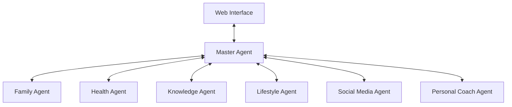

# Life Management Agency - Architecture Overview

## System Architecture

### 1. Core Components

#### 1.1 Agency Layer
```
agency.py
```
- Central coordination system
- Agent lifecycle management
- Inter-agent communication
- System state management
- Event handling and routing

#### 1.2 Agent Layer
Each agent is a specialized module focusing on specific life domains:

```
master_agent/
├── master_agent.py      # Orchestration and coordination
└── instructions.md      # Agent-specific guidelines

family_coach_agent/
├── family_coach_agent.py
└── tools/
    └── FamilyRelationshipTool.py

health_agent/
├── health_agent.py
└── tools/
    ├── FitnessTrackerTool.py
    └── MemoryTool.py

knowledge_agent/
├── knowledge_agent.py
└── tools/
    └── TavilySearchTool.py
```

#### 1.3 Web Interface Layer
```
static/
├── index.html          # Core HTML structure
├── styles.css          # UI styling
└── app.js             # Client-side functionality
```

### 2. Communication Flow



### 3. Data Flow

1. **User Input**
   - Web interface captures user interactions
   - Messages are formatted and validated
   - Sent to appropriate agent via Master Agent

2. **Agent Processing**
   - Agent receives request
   - Utilizes specialized tools
   - Processes information
   - Returns structured response

3. **Response Handling**
   - Master Agent coordinates responses
   - UI updates in real-time
   - State management maintains consistency

### 4. Technical Implementation

#### 4.1 Frontend Architecture
- Pure JavaScript for lightweight performance
- Event-driven architecture
- Real-time updates via DOM manipulation
- Responsive design with CSS Grid/Flexbox

```javascript
// Component Structure
- Navigation (Agent Selection)
- Chat Interface
- Tools Panel
- Status Display
```

#### 4.2 Backend Architecture
- Python-based agent system
- Tool-based modular design
- Event-driven communication
- Stateless request handling

```python
class Agent:
    def __init__(self):
        self.tools = []
        self.state = {}

    def process_request(self, request):
        # Request handling logic
        pass

    def use_tool(self, tool_name, params):
        # Tool execution logic
        pass
```

### 5. Security Considerations

1. **Input Validation**
   - All user input is sanitized
   - Request validation at multiple levels
   - Secure data handling

2. **Data Protection**
   - Local storage only
   - No external data transmission
   - Tool access control

### 6. Scalability

The system is designed for extensibility:

1. **Agent Addition**
   - New agents can be added by implementing the base Agent class
   - Tool registration system for new capabilities
   - Dynamic UI updates for new agents

2. **Tool Integration**
   - Modular tool system
   - Standard tool interface
   - Easy registration process

### 7. Development Guidelines

1. **Adding New Agents**
```python
class NewAgent(BaseAgent):
    def __init__(self):
        super().__init__()
        self.register_tools()

    def register_tools(self):
        # Tool registration logic
        pass
```

2. **Creating New Tools**
```python
class NewTool(BaseTool):
    def __init__(self):
        super().__init__()
        self.name = "New Tool"
        self.description = "Tool description"

    def execute(self, params):
        # Tool execution logic
        pass
```

### 8. Future Considerations

1. **Planned Enhancements**
   - Real-time collaboration features
   - Advanced tool integration
   - Machine learning capabilities
   - Extended agent functionalities

2. **Technical Debt Management**
   - Regular code reviews
   - Documentation updates
   - Performance optimization
   - Security audits

This architecture provides a solid foundation for the Life Management Agency while maintaining flexibility for future growth and improvements.
